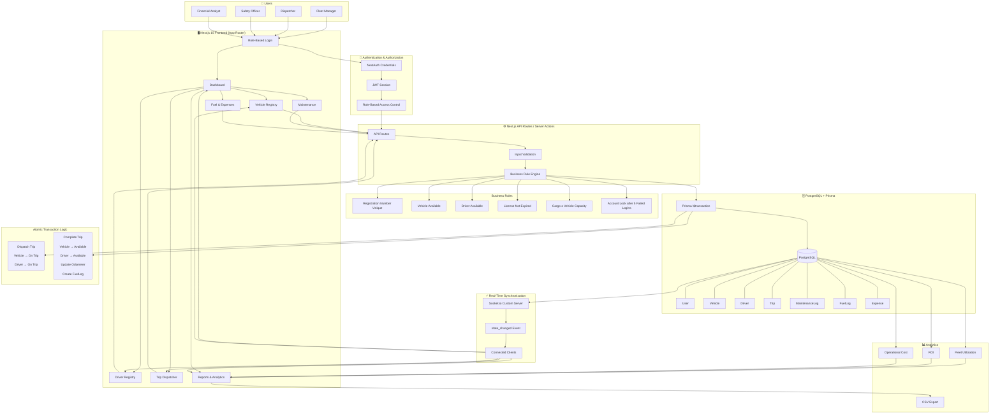

<div align="center">

<!-- Frontend Stack -->


<br />

<!-- Backend & Real-time -->


<br />

<!-- Database & Infrastructure -->


<br />
<br />

# 🚚 TransitOps | Smart Transport Operations Platform
### Centralized Fleet Lifecycle & Dispatch Management

<br />

**A robust, enterprise-grade logistics platform engineered for real-time dispatch, automated asset maintenance, and data-driven financial analytics.**

</div>
---

## 🌐 Live Demo

**Demo Video:** `https://your-demo-video-link.com`

---

# Quick Access (Under 60 Seconds)

### Test Credentials

| Role              | Email                                                                       | Password    |
| ----------------- | --------------------------------------------------------------------------- | ----------- |
| Fleet Manager     | [fleet_manager@transitops.com](mailto:fleet_manager@transitops.com)         | password123 |
| Dispatcher        | [dispatcher@transitops.com](mailto:dispatcher@transitops.com)               | password123 |
| Safety Officer    | [safety_officer@transitops.com](mailto:safety_officer@transitops.com)       | password123 |
| Financial Analyst | [financial_analyst@transitops.com](mailto:financial_analyst@transitops.com) | password123 |

---

# Problem Statement

Many logistics companies—especially small and medium fleet operators—still manage vehicles, drivers, dispatch records, maintenance history, and operating expenses using spreadsheets, WhatsApp messages, paper logbooks, and disconnected software.

This approach creates inconsistent data, duplicate records, manual coordination overhead, delayed reporting, and costly operational mistakes such as assigning unavailable vehicles, dispatching suspended drivers, exceeding vehicle capacity, or missing maintenance schedules.

**TransitOps** replaces these fragmented workflows with a centralized, real-time operations platform where every critical business rule is enforced on the server before data is committed to the database.

Instead of simply storing records, the platform actively prevents invalid fleet operations.

---

# Project Goals

The project was intentionally designed around the evaluation priorities specified for the **Odoo Hackathon 2026**:

| Priority             | TransitOps Implementation                                                            |
| -------------------- | ------------------------------------------------------------------------------------ |
| Database Design      | Normalized PostgreSQL schema with relational integrity via Prisma                    |
| Minimal Dependencies | Native CSS charts, Blob CSV export, Prisma Adapter, no heavy visualization libraries |
| Real-Time Updates    | Socket.io custom server broadcasting synchronized state                              |
| Validation           | Server-side business rule validation with descriptive error messages                 |
| UI                   | Clean responsive dashboard built using Tailwind CSS                                  |
| Code Quality         | Strong TypeScript typing, modular architecture, reusable services                    |

---

# Screenshots


## Login Screen


---

## Fleet Manager Dashboard


---

## Vehicle Registry


---

## Maintenance Page


---

## Dispatcher Dashboard


---

## Safety Officer


---

## Financial Analyst - Fuel & Expenses


---

## Financial Analyst - Reports


---


# Technology Stack

| Category       | Technology                         |
| -------------- | ---------------------------------- |
| Framework      | Next.js 15 (App Router)            |
| Language       | TypeScript                         |
| Database       | PostgreSQL                         |
| ORM            | Prisma ORM + @prisma/adapter-pg    |
| Authentication | NextAuth.js (Credentials Provider) |
| Authorization  | JWT-based RBAC                     |
| Real-Time      | Socket.io (Custom Server)          |
| Validation     | Zod-style validation               |
| Styling        | Tailwind CSS                       |
| Charts         | Native CSS                         |
| CSV Export     | Browser Blob API                   |
| Runtime        | Node.js                            |

---

# System Architecture


---

# Data Flow



---

# Database Design

Database design is the foundation of TransitOps.

The schema models operational relationships rather than flat records, ensuring consistency, eliminating duplication, and enabling atomic updates.

## Core Entities

```
User
│
├── Role
│
├── Driver
│
├── Vehicle
│
├── Trip
│
├── MaintenanceLog
│
├── FuelLog
│
└── Expense
```

---

## Entity Relationships

```
User
 └── Role

Vehicle
 ├── Trips
 ├── MaintenanceLogs
 ├── FuelLogs
 └── Expenses

Driver
 └── Trips

Trip
 ├── Driver
 ├── Vehicle
 ├── FuelLog
 └── Expense
```

---

## Status Models

### Vehicle

```
Available
↓

On Trip
↓

Available
```

or

```
Available

↓

In Shop

↓

Available
```

or

```
Retired
```

---

### Driver

```
Available

↓

On Trip

↓

Available
```

or

```
Off Duty
```

or

```
Suspended
```

---

### Trip

```
Draft

↓

Dispatched

↓

Completed
```

or

```
Cancelled
```

---

# Role-Based Access Control

TransitOps implements four operational roles.

| Role              | Responsibilities               |
| ----------------- | ------------------------------ |
| Fleet Manager     | Vehicles, maintenance logs     |
| Dispatcher        | Dispatch operations and trips  |
| Safety Officer    | Driver compliance and licenses |
| Financial Analyst | Fuel, expenses, ROI reports    |

Each role only sees the modules required for their operational responsibility.

Authorization is enforced server-side.

---

# Key Business Rules

Unlike CRUD applications, TransitOps embeds actual logistics rules inside the backend.

---

## Vehicle Validation

✅ Registration number must be unique.

✅ Vehicle cannot be dispatched when:

* In Shop
* Retired

---

## Driver Validation

Dispatch is blocked if:

* License expired
* Driver suspended
* Driver already on trip

---

## Cargo Validation

Every trip validates

```
cargoWeight <= vehicle.maxCapacity
```

Example error:

```
Cargo exceeds vehicle capacity.

Vehicle Capacity : 500kg

Requested Cargo : 620kg
```

---

## Atomic Dispatch

Dispatching is not multiple independent updates.

Everything happens inside **one database transaction**.

* Trip status updated
* Driver status updated
* Vehicle status updated

Either every change succeeds...

or none do.

This prevents inconsistent fleet state.

---

## Trip Completion

Completing a trip automatically

* frees vehicle
* frees driver
* updates odometer
* creates FuelLog
* recalculates utilization

All inside one transaction.

---

## Login Security

Accounts automatically lock after

```
5 failed login attempts
```

to reduce brute-force attacks.

---

# Real-Time Synchronization

Every mutation emits

```
state_changed
```

through Socket.io.

Connected clients automatically refresh:

* Dashboard
* Vehicle Registry
* Dispatcher
* Reports

without any manual refresh.

---

# Technical Highlights

## 1. Atomic Transactions

```ts
await prisma.$transaction(async (tx) => {
  await tx.trip.update(...)

  await tx.vehicle.update(...)

  await tx.driver.update(...)
})
```

**Why?**

Fleet state must never become partially updated. If any update fails, the entire operation rolls back automatically, preserving database consistency.

---

## 2. Decimal Instead of Float

```prisma
cargoWeight Decimal

fuelCost Decimal

revenue Decimal
```

**Why?**

Floating-point arithmetic introduces precision errors that are unacceptable for financial values and measured cargo. Using `Decimal` guarantees accurate calculations and predictable reporting.

---

## 3. Role Stored in JWT

```ts
session.user.role = token.role
```

**Why?**

Embedding the role inside the signed JWT removes the need for a database lookup on every request, reducing latency while keeping authorization decisions secure and consistent.

---

# Real-Time Flow

```
Mutation

↓

Prisma

↓

Database Updated

↓

Socket.io Broadcast

↓

state_changed

↓

Connected Clients

↓

Automatic Refresh
```

---

# Project Structure

```
TransitOps/

├── app/

├── components/

├── prisma/

│   ├── schema.prisma

│   ├── migrations/

│   └── seed.ts

├── lib/

├── actions/

├── services/

├── socket/

├── public/

├── middleware.ts

├── server.ts

└── README.md
```

---

# Local Development

## Clone

```bash
git clone https://github.com/Hussain-Tinwala/TransitOps

cd transitops
```

---

## Start PostgreSQL

```bash
docker compose up -d
```

---

## Install

```bash
npm install
```

---

## Environment Variables

Create

```
.env
```

```env
DATABASE_URL=

AUTH_SECRET=

NEXTAUTH_URL=

SOCKET_PORT=
```

---

## Database

```bash
npx prisma migrate dev
```

---

## Seed

```bash
npm run seed
```

---

## Start

```bash
npm run dev
```

---

# Demo Script (Evaluator Walkthrough)

### 1.

Login as

```
Dispatcher
```

---

### 2.

Create Vehicle

```
Van-05

Capacity : 500kg
```

Status becomes

```
Available
```

---

### 3.

Login as

```
Safety Officer
```

Register

```
Alex
```

License valid.

Status

```
Available
```

---

### 4.

Login as

```
Dispatcher
```

Create Trip

```
Vehicle

↓

Van-05

Driver

↓

Alex

Cargo

↓

450kg
```

Validation succeeds.

---

### 5.

Click

```
Dispatch
```

Observe

Vehicle

```
On Trip
```

Driver

```
On Trip
```

Dashboard updates instantly on every connected client without reloading.

---

### 6.

Complete Trip

Enter

```
Ending Odometer

Fuel Used

Revenue
```

System automatically

* updates vehicle mileage
* creates FuelLog
* releases driver
* releases vehicle

---

### 7.

Open Reports

Observe

* Fleet Utilization
* Revenue
* Fuel Cost
* Operational Cost
* ROI

updated immediately.

---

# Performance Considerations

* Prisma connection pooling
* Minimal client-side JavaScript
* Server Components where appropriate
* JWT-based authentication
* Single transaction writes
* Lightweight Socket events
* No heavy visualization libraries
* Efficient relational queries

---

# Future Improvements

Given additional development time, the following enhancements would be implemented:

* Update/Delete operations for Vehicles and Drivers
* Predictive maintenance using historical service intervals
* GPS tracking and live vehicle location
* Route optimization
* Driver performance analytics
* Maintenance reminders
* Fuel anomaly detection
* Audit logging for administrative actions
* Email/SMS notifications
* Offline-first mobile application
* Unit and integration test suite
* CI/CD deployment pipeline
* Multi-company tenancy
* File uploads for documents and licenses

---

# Why These Design Decisions?

Every technical decision in TransitOps was made with the evaluation priorities in mind.

* PostgreSQL was selected for relational consistency.
* Prisma provides strongly typed database access and transactional integrity.
* Socket.io delivers instant operational visibility without polling.
* JWT-based RBAC minimizes repeated database reads.
* Native browser APIs replace heavy libraries wherever practical.
* Business rules are enforced on the server, ensuring correctness regardless of client behavior.

The objective was not to maximize feature count, but to build a reliable operations platform whose data integrity and architectural decisions would remain trustworthy under real-world logistics workflows.

---

# License

This project was developed as a solo submission for the **Odoo Hackathon 2026 Virtual Round**.

---

## Final Notes for Evaluators

TransitOps is intentionally designed as a backend-first system where business correctness takes precedence over interface complexity. The application demonstrates transactional consistency, normalized relational modeling, role-based authorization, real-time synchronization, and operational validation—principles that directly align with production-grade fleet management systems.

While built within an eight-hour hackathon constraint, the architecture is modular and scalable, providing a foundation that can be extended into a full enterprise transport management platform with minimal structural changes.
